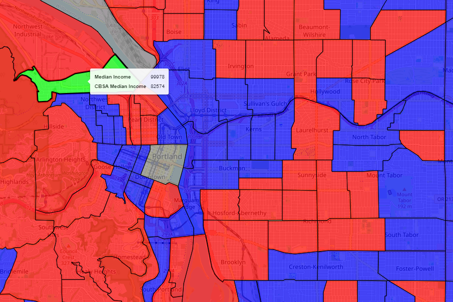

# NACA Loan Eligibility Viewer

A Django web application to view census tract eligibility for NACA (Neighborhood Assistance Corporation of America) loans.



## Project Overview

This application integrates multiple open-source data sources to visualize and analyze census tract eligibility for NACA home loans. It combines geospatial information from US Census Tract Shape Files and CBSA/MSA (Core Based Statistical Area/Metropolitan Statistical Area) shape files, comparing median census tract income levels to overall metropolitan statistical areas.

## Requirements

- Python 3.11
- Django
- GeoPandas
- Other dependencies listed in `requirements.txt`

## Getting Started

1. Install the required dependencies:
   ```
   pip install -r requirements.txt
   ```

2. Run the Django development server:
   ```
   python manage.py runserver
   ```

3. Browse to http://127.0.0.1:8000/map/

## Compiling Other States' Shapefile

To include data for states other than Oregon:

1. Edit the main function in `DataExplorer.py` to point at the new state's census tract shapefile.
2. Run the script to generate a new data source for the map page.

Note: Median income data and metropolitan statistical area shapefiles for the entire US from 2021 are included in the `data` folder.

Currently, only Oregon is included for performance reasons.

### Data Sources

- [US Census Tract Shape Files by State](https://www.census.gov/cgi-bin/geo/shapefiles/index.php?year=2022&layergroup=Census+Tracts)
- [US CBSA / MSA shape file](https://www.census.gov/geographies/reference-maps/2018/geo/cbsa.html)
- [Median Income Census Data](https://data.census.gov/map?q=Income+and+Poverty&tid=ACSST1Y2021.S1903&layer=VT_2021_040_00_PP_D1&mode=thematic&loc=43.3751,-113.1138,z1.4027)

## Features

- Integration of multiple geospatial data sources
- Logical comparison of median census tract income levels to metropolitan statistical areas
- Identification of qualifying census tracts for NACA home loans
- Interactive map visualization of eligible areas


